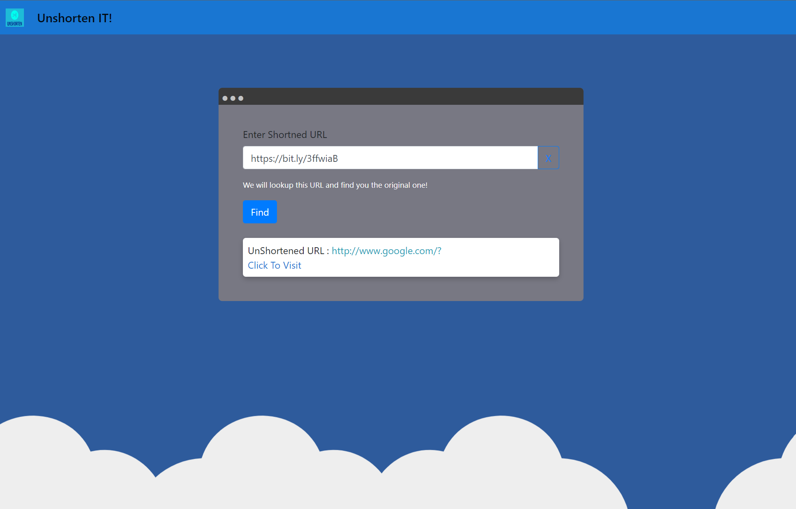

# Unshorten-it

A Fast API application to unshorten URL

This API allows you to unshorten a shortened URL

## Build Docker Image

- docker build -t unshortenit .
- docker run -d --name urlunshortener -p 8082:8000 unshortenit

## Demo

Paste the shortened url and see the un shortened one appear!
[Try Now](https://unshorten-it.herokuapp.com/)

